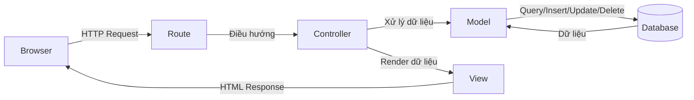

# BÁO CÁO PHÂN TÍCH VÀ THIẾT KẾ HỆ THỐNG WEBSITE THƯƠNG MẠI ĐIỆN TỬ VIBE TECH

## Step 1. Giới thiệu

### 1.1. Mô tả đề tài
Đề tài xây dựng hệ thống website thương mại điện tử **Vibe Tech** nhằm hỗ trợ kinh doanh các thiết bị công nghệ như chuột gaming, bàn phím cơ, tai nghe, màn hình và phụ kiện. Hệ thống được phát triển theo mô hình web application, cho phép khách hàng tìm kiếm sản phẩm, thêm vào giỏ hàng, đặt hàng, theo dõi lịch sử mua hàng; đồng thời cung cấp khu vực quản trị để quản lý danh mục, thương hiệu, thuộc tính, sản phẩm, người dùng, bình luận, đơn hàng và thống kê kinh doanh.

### 1.2. Phạm vi đề tài
Phạm vi của đề tài được giới hạn trong 2 phân hệ chính:

1. **Phân hệ khách hàng**
   Bao gồm đăng ký, đăng nhập, xem danh mục, xem chi tiết sản phẩm, tìm kiếm, lọc sản phẩm, thêm vào giỏ hàng, thêm yêu thích, bình luận, đặt hàng và hủy đơn.
2. **Phân hệ quản trị**
   Bao gồm dashboard thống kê, quản lý quản trị viên, khách hàng, danh mục, thương hiệu, thuộc tính mẫu, sản phẩm, bình luận và đơn hàng.

Ngoài nghiệp vụ chính, hệ thống còn tích hợp cơ chế xác thực, kiểm tra quyền truy cập, kiểm tra trạng thái tài khoản, quản lý file ảnh, hiển thị thông báo, và các thành phần hỗ trợ giao diện responsive.

[📸 Chèn hình ảnh: Toàn cảnh trang chủ Vibe Tech với banner, danh mục nổi bật, danh sách sản phẩm và thanh điều hướng.]

### 1.3. Mục tiêu của đề tài
Mục tiêu của đề tài là xây dựng một hệ thống bán hàng trực tuyến có:

1. Giao diện thân thiện với người dùng trên cả máy tính và điện thoại.
2. Quy trình mua hàng rõ ràng từ xem sản phẩm đến đặt hàng.
3. Khu vực quản trị có khả năng vận hành dữ liệu bán hàng tập trung.
4. Kiến trúc đủ rõ ràng để dễ mở rộng về sau.

### 1.4. Công cụ và công nghệ sử dụng

| Nhóm công cụ | Công nghệ sử dụng | Vai trò trong hệ thống |
| --- | --- | --- |
| Ngôn ngữ lập trình | PHP 8.2, JavaScript, HTML, CSS | Xây dựng toàn bộ backend và frontend |
| Framework backend | Laravel 12 | Tổ chức kiến trúc MVC, routing, ORM, middleware |
| Xác thực | Laravel Jetstream, Fortify, Sanctum | Đăng ký, đăng nhập, hồ sơ người dùng, token, bảo mật |
| Giao diện | Blade, Tailwind CSS | Xây dựng giao diện người dùng và quản trị |
| Thư viện frontend | Alpine.js, Swiper, Chart.js, SweetAlert2, FilePond, CKEditor 5 | Tương tác UI, carousel, biểu đồ, thông báo, upload ảnh, soạn thảo nội dung |
| Cơ sở dữ liệu | MySQL | Lưu trữ dữ liệu nghiệp vụ |
| Build tool | Vite | Biên dịch tài nguyên frontend |
| Môi trường phát triển | XAMPP, Visual Studio Code | Chạy local server và lập trình |
| Quản lý mã nguồn | Git | Theo dõi phiên bản mã nguồn |
| Kiểm thử | PHPUnit/Pest | Hỗ trợ viết và chạy test |

### 1.5. Kiến trúc tổng quan
Hệ thống được xây dựng theo mô hình **MVC (Model - View - Controller)**:

1. **Model** chịu trách nhiệm thao tác dữ liệu với các bảng như `users`, `products`, `orders`, `comments`, `wishlists`, `carts`.
2. **View** sử dụng Blade để hiển thị giao diện khách hàng và quản trị.
3. **Controller** điều phối luồng xử lý giữa request, model và view.
4. **Middleware** như `IsAdmin` và `checkUserStatus` dùng để kiểm soát quyền truy cập và trạng thái tài khoản.

#### 1.5.1. Sơ đồ kiến trúc tổng quan MVC

```text
+-------------------+
|      Browser      |
|  (Người dùng)     |
+-------------------+
          |
          | HTTP Request
          v
+-------------------+
|       Route       |
|   routes/web.php  |
+-------------------+
          |
          | Điều hướng request
          v
+-------------------+
|    Controller     |
| Xử lý nghiệp vụ   |
+-------------------+
     |          |
     |          | Truyền dữ liệu sang giao diện
     |          v
     |    +-------------------+
     |    |       View        |
     |    | Blade Template    |
     |    +-------------------+
     |              |
     |              | HTML Response
     |              v
     |      +-------------------+
     +----> |      Browser      |
            | Hiển thị kết quả  |
            +-------------------+
     
          |
          | Gọi Model để xử lý dữ liệu
          v
+-------------------+
|       Model       |
| Eloquent ORM      |
+-------------------+
          |
          | Truy vấn / cập nhật dữ liệu
          v
+-------------------+
|     Database      |
|      MySQL        |
+-------------------+
```

#### 1.5.2. Sơ đồ MVC dạng Mermaid



[📸 Chèn hình ảnh: Sơ đồ kiến trúc tổng quan MVC của dự án gồm Browser, Route, Controller, Model, Database và View.]

---

## Step 2. Phân tích hệ thống

### 2.1. Bài toán nghiệp vụ
Vibe Tech giải quyết bài toán bán hàng trực tuyến cho cửa hàng thiết bị công nghệ. Trong thực tế, cửa hàng cần:

1. Trưng bày sản phẩm theo danh mục và thương hiệu.
2. Cho phép khách hàng tìm kiếm, lọc và chọn mua nhanh.
3. Quản lý tồn kho khi đơn hàng phát sinh hoặc bị hủy.
4. Theo dõi vòng đời đơn hàng từ chờ xác nhận đến hoàn thành.
5. Quản trị nội dung bán hàng và dữ liệu người dùng một cách tập trung.

### 2.2. Tác nhân của hệ thống

| Tác nhân | Mô tả | Quyền chính |
| --- | --- | --- |
| Khách chưa đăng nhập | Người truy cập website công khai | Xem trang chủ, xem danh mục, xem chi tiết sản phẩm, tìm kiếm |
| Khách đã đăng nhập | Người dùng có tài khoản khách hàng | Thêm giỏ hàng, yêu thích, bình luận, đặt hàng, hủy đơn, xem lịch sử mua hàng |
| Quản trị viên | Người dùng có `user_type = 1` | Truy cập `/admin`, quản lý dữ liệu và thống kê |
| Hệ thống | Thành phần tự động | Sinh slug, tính giảm giá, cập nhật tồn kho, kiểm tra quyền, khóa tài khoản theo quy tắc |

### 2.3. Phân tích các yêu cầu chức năng

| Mã yêu cầu | Nhóm chức năng | Mô tả chi tiết |
| --- | --- | --- |
| F01 | Xác thực người dùng | Đăng ký, đăng nhập, đăng xuất, quên mật khẩu, cập nhật hồ sơ |
| F02 | Hiển thị sản phẩm | Hiển thị danh sách sản phẩm mới, sản phẩm theo danh mục, sản phẩm chi tiết |
| F03 | Tìm kiếm và lọc | Tìm theo tên, lọc theo thương hiệu, khoảng giá, sắp xếp theo giá/tên/thời gian |
| F04 | Quản lý giỏ hàng | Thêm sản phẩm, thay đổi số lượng, xóa sản phẩm, tính tổng tiền |
| F05 | Đặt hàng | Nhập thông tin nhận hàng, chọn phương thức thanh toán, tạo đơn và chi tiết đơn |
| F06 | Theo dõi đơn hàng | Xem lịch sử đơn hàng, xem chi tiết đơn, hủy đơn khi còn hợp lệ |
| F07 | Danh sách yêu thích | Thêm hoặc bỏ sản phẩm khỏi wishlist |
| F08 | Bình luận và đánh giá | Gửi bình luận, chấm sao, xóa bình luận của chính mình |
| F09 | Quản lý danh mục | Thêm, sửa, xóa, lọc, đếm số sản phẩm theo danh mục |
| F10 | Quản lý thương hiệu | Thêm, sửa, xóa, lọc, upload logo thương hiệu |
| F11 | Quản lý thuộc tính mẫu | Thêm, sửa, xóa thuộc tính mẫu dùng cho sản phẩm |
| F12 | Quản lý sản phẩm | Thêm, sửa, xóa sản phẩm, upload thumbnail và gallery, gán thuộc tính kỹ thuật |
| F13 | Quản lý người dùng | Quản lý admin, xem danh sách khách hàng, thay đổi trạng thái |
| F14 | Quản lý bình luận | Duyệt/ẩn bình luận, xóa bình luận |
| F15 | Quản lý đơn hàng | Tìm kiếm, lọc trạng thái, xem chi tiết đơn, cập nhật trạng thái đơn |
| F16 | Dashboard quản trị | Thống kê doanh thu, đơn hàng mới, khách hàng mới, sản phẩm sắp hết hàng |

### 2.4. Phân tích các yêu cầu phi chức năng

| Nhóm yêu cầu | Nội dung |
| --- | --- |
| Bảo mật | Dùng middleware xác thực, phân quyền admin, kiểm tra trạng thái tài khoản, mật khẩu được hash |
| Toàn vẹn dữ liệu | Sử dụng khóa ngoại, validate dữ liệu form, tự động cập nhật tồn kho khi tạo/hủy đơn |
| Hiệu năng | Eloquent relationship, eager loading trong danh sách sản phẩm, bình luận, đơn hàng |
| Khả năng sử dụng | Giao diện responsive, thông báo lỗi/thành công rõ ràng bằng SweetAlert2 |
| Khả năng mở rộng | Kiến trúc MVC tách lớp rõ ràng, dùng model/controller riêng cho từng nhóm nghiệp vụ |
| Tính trực quan | Admin có dashboard biểu đồ, front-office có bộ lọc, wishlist, carousel sản phẩm |

### 2.5. Phân tích hoạt động của hệ thống

#### 2.5.1. Luồng hoạt động phía khách hàng

1. Người dùng truy cập trang chủ để xem sản phẩm mới và danh mục nổi bật.
2. Người dùng chọn danh mục hoặc dùng thanh tìm kiếm để tìm sản phẩm.
3. Người dùng lọc thêm theo thương hiệu, khoảng giá và cách sắp xếp.
4. Khi vào trang chi tiết sản phẩm, người dùng xem mô tả, gallery, thông số kỹ thuật và đánh giá.
5. Người dùng thêm sản phẩm vào giỏ hàng hoặc danh sách yêu thích.
6. Khi thanh toán, hệ thống lấy dữ liệu giỏ hàng, tính phí ship và tạo đơn hàng.
7. Sau khi đặt hàng, người dùng theo dõi lịch sử đơn và có thể hủy đơn nếu còn trong trạng thái cho phép.

#### 2.5.2. Luồng hoạt động phía quản trị

1. Quản trị viên đăng nhập và vào khu vực `/admin`.
2. Dashboard hiển thị doanh thu, sản phẩm sắp hết, khách hàng mới và đơn hàng mới.
3. Quản trị viên quản lý dữ liệu nền gồm danh mục, thương hiệu, thuộc tính mẫu và sản phẩm.
4. Quản trị viên duyệt bình luận, ẩn/xóa bình luận không phù hợp.
5. Quản trị viên xem danh sách đơn hàng, mở chi tiết đơn và cập nhật trạng thái theo quy tắc.
6. Khi đơn bị hủy, hệ thống cộng lại tồn kho và lưu thông tin người hủy.

### 2.6. Quy tắc nghiệp vụ rút ra từ mã nguồn

| Mã quy tắc | Quy tắc nghiệp vụ | Mô tả |
| --- | --- | --- |
| BR01 | Sinh slug tự động | `categories`, `products`, `attribute_templates` tự sinh slug từ tên hiển thị |
| BR02 | Giá giảm phải hợp lệ | `sale_price` phải nhỏ hơn `price` |
| BR03 | Tính phần trăm giảm giá | `discount_percent` được tự tính khi lưu sản phẩm |
| BR04 | Đồng bộ trạng thái sản phẩm | Nếu `stock_quantity <= 0` thì sản phẩm chuyển sang hết hàng |
| BR05 | Không vượt tồn kho | Số lượng thêm vào giỏ không được lớn hơn tồn kho |
| BR06 | Phí vận chuyển | Đơn hàng từ `500.000đ` trở lên được miễn phí ship, ngược lại là `30.000đ` |
| BR07 | Chuyển trạng thái đơn hàng có ràng buộc | `pending -> confirmed/cancelled`, `confirmed -> shipping`, `shipping -> completed` |
| BR08 | Hủy đơn hoàn tồn kho | Khi đơn bị hủy, số lượng sản phẩm được cộng lại vào kho |
| BR09 | Khóa tài khoản vì hủy đơn nhiều lần | Khách hàng bị khóa nếu có từ 5 đơn `cancelled` trở lên |
| BR10 | Giới hạn bình luận | Một người dùng chỉ được bình luận 1 lần trong khoảng 10 phút |

[📸 Chèn hình ảnh: Ảnh chụp trang chi tiết sản phẩm có phần giá, thông số kỹ thuật, bình luận và nút thêm giỏ hàng.]

---

## Step 3. Sơ đồ hệ thống

### 3.1. Sơ đồ ERD

#### 3.1.1. Danh sách thực thể trong ERD

| Thực thể | Khóa chính | Khóa ngoại | Thuộc tính quan trọng | Ý nghĩa |
| --- | --- | --- | --- | --- |
| `users` | `id` | - | `name`, `email`, `password`, `user_type`, `phone`, `address`, `status` | Lưu thông tin quản trị viên và khách hàng |
| `categories` | `id` | - | `name`, `description`, `thumbnail`, `slug`, `status` | Nhóm sản phẩm |
| `brands` | `id` | - | `name`, `description`, `logo`, `status` | Thương hiệu sản phẩm |
| `attribute_templates` | `id` | - | `name`, `display_name`, `suggest_value` | Thuộc tính mẫu cho thông số kỹ thuật |
| `products` | `id` | `category_id`, `brand_id` | `sku`, `name`, `description`, `thumbnail`, `price`, `sale_price`, `stock_quantity`, `slug`, `status`, `discount_percent`, `attributes` | Sản phẩm bán trong hệ thống |
| `product_images` | `id` | `product_id` | `image_path` | Ảnh gallery của sản phẩm |
| `carts` | `id` | `user_id` | - | Giỏ hàng của người dùng |
| `cart_items` | `id` | `cart_id`, `product_id` | `quantity`, `price` | Sản phẩm có trong giỏ hàng |
| `wishlists` | `id` | `user_id`, `product_id` | - | Danh sách yêu thích |
| `comments` | `id` | `user_id`, `product_id` | `comment_content`, `comment_rating`, `comment_status` | Bình luận và đánh giá sản phẩm |
| `orders` | `id` | `user_id`, `updated_by` | `order_code`, `sub_total`, `shipping_fee`, `total_amount`, `status`, `payment_method`, `customer_name`, `customer_phone`, `customer_email`, `customer_address`, `reason_cancel`, `updated_by_user_type` | Đơn hàng của khách |
| `order_details` | `id` | `order_id`, `product_id` | `quantity`, `unit_price` | Chi tiết từng sản phẩm trong đơn |

#### 3.1.2. Bảng mô tả quan hệ ERD

| Quan hệ | Kiểu quan hệ | Mô tả |
| --- | --- | --- |
| `users` - `carts` | 1 - 1 | Mỗi khách hàng có tối đa một giỏ hàng |
| `carts` - `cart_items` | 1 - n | Một giỏ hàng có nhiều dòng sản phẩm |
| `users` - `wishlists` | 1 - n | Một người dùng có nhiều sản phẩm yêu thích |
| `users` - `orders` | 1 - n | Một người dùng có nhiều đơn hàng |
| `users` - `comments` | 1 - n | Một người dùng có nhiều bình luận |
| `categories` - `products` | 1 - n | Một danh mục chứa nhiều sản phẩm |
| `brands` - `products` | 1 - n | Một thương hiệu có nhiều sản phẩm |
| `products` - `product_images` | 1 - n | Một sản phẩm có nhiều ảnh chi tiết |
| `products` - `cart_items` | 1 - n | Một sản phẩm có thể xuất hiện ở nhiều giỏ hàng |
| `products` - `wishlists` | 1 - n | Một sản phẩm có thể được nhiều người yêu thích |
| `products` - `comments` | 1 - n | Một sản phẩm nhận nhiều bình luận |
| `orders` - `order_details` | 1 - n | Một đơn hàng gồm nhiều dòng chi tiết |
| `products` - `order_details` | 1 - n | Một sản phẩm có thể nằm trong nhiều đơn hàng |
| `users` - `orders.updated_by` | 1 - n | Người cập nhật/hủy đơn có thể là admin hoặc khách |

[📸 Chèn hình ảnh: Sơ đồ ERD của các bảng nghiệp vụ chính gồm users, products, categories, brands, carts, orders, comments và wishlists.]

### 3.2. Sơ đồ Use Case

#### 3.2.1. Bảng use case tổng quát

| Actor | Use case | Mô tả ngắn |
| --- | --- | --- |
| Khách chưa đăng nhập | Xem trang chủ | Xem sản phẩm mới, danh mục nổi bật |
| Khách chưa đăng nhập | Tìm kiếm sản phẩm | Tìm sản phẩm theo tên |
| Khách chưa đăng nhập | Xem danh mục | Xem sản phẩm theo danh mục và bộ lọc |
| Khách chưa đăng nhập | Xem chi tiết sản phẩm | Xem gallery, mô tả, thông số, đánh giá |
| Khách chưa đăng nhập | Đăng ký/Đăng nhập | Tạo tài khoản hoặc xác thực để mua hàng |
| Khách đã đăng nhập | Thêm vào giỏ hàng | Tạo hoặc cập nhật `cart_items` |
| Khách đã đăng nhập | Quản lý giỏ hàng | Tăng/giảm số lượng, xóa sản phẩm |
| Khách đã đăng nhập | Đặt hàng | Tạo đơn hàng từ dữ liệu giỏ |
| Khách đã đăng nhập | Quản lý đơn hàng cá nhân | Xem lịch sử đơn và hủy đơn |
| Khách đã đăng nhập | Quản lý wishlist | Thêm/bỏ sản phẩm yêu thích |
| Khách đã đăng nhập | Bình luận sản phẩm | Gửi đánh giá sao và nội dung nhận xét |
| Quản trị viên | Quản lý danh mục | Thêm, sửa, xóa, bật/tắt trạng thái |
| Quản trị viên | Quản lý thương hiệu | Thêm, sửa, xóa logo và trạng thái |
| Quản trị viên | Quản lý thuộc tính | Tạo thuộc tính mẫu cho sản phẩm |
| Quản trị viên | Quản lý sản phẩm | Thêm, sửa, xóa sản phẩm và ảnh |
| Quản trị viên | Quản lý người dùng | Quản lý admin và xem danh sách khách hàng |
| Quản trị viên | Quản lý bình luận | Duyệt ẩn/hiện và xóa bình luận |
| Quản trị viên | Quản lý đơn hàng | Cập nhật trạng thái xử lý đơn |
| Quản trị viên | Xem dashboard | Theo dõi doanh thu và các chỉ số chính |

#### 3.2.2. Đặc tả use case trọng tâm

##### UC01. Đăng ký tài khoản

| Thuộc tính | Mô tả |
| --- | --- |
| Tác nhân | Khách chưa đăng nhập |
| Mục tiêu | Tạo tài khoản mới để sử dụng các chức năng mua hàng |
| Tiền điều kiện | Chưa có tài khoản trùng email/số điện thoại |
| Luồng chính | 1. Người dùng mở trang đăng ký. 2. Nhập họ tên, số điện thoại, email, mật khẩu. 3. Hệ thống kiểm tra hợp lệ. 4. Hệ thống lưu tài khoản mới. |
| Luồng thay thế | Nếu email hoặc số điện thoại đã tồn tại, hệ thống báo lỗi và yêu cầu nhập lại. |
| Hậu điều kiện | Tài khoản được tạo thành công trong bảng `users`. |

##### UC02. Tìm kiếm và lọc sản phẩm

| Thuộc tính | Mô tả |
| --- | --- |
| Tác nhân | Khách chưa đăng nhập hoặc đã đăng nhập |
| Mục tiêu | Tìm đúng sản phẩm theo nhu cầu |
| Tiền điều kiện | Hệ thống có dữ liệu sản phẩm ở trạng thái đang bán |
| Luồng chính | 1. Người dùng nhập từ khóa hoặc chọn danh mục. 2. Hệ thống áp dụng bộ lọc giá, thương hiệu, sắp xếp. 3. Hệ thống trả về danh sách phù hợp. |
| Luồng thay thế | Nếu không có dữ liệu phù hợp, hệ thống hiển thị trạng thái rỗng. |
| Hậu điều kiện | Người dùng xem được danh sách sản phẩm cần tìm. |

##### UC03. Thêm sản phẩm vào giỏ hàng

| Thuộc tính | Mô tả |
| --- | --- |
| Tác nhân | Khách đã đăng nhập |
| Mục tiêu | Lưu sản phẩm cần mua vào giỏ hàng |
| Tiền điều kiện | Người dùng đã đăng nhập, sản phẩm còn tồn kho |
| Luồng chính | 1. Người dùng chọn số lượng. 2. Hệ thống kiểm tra tồn kho. 3. Hệ thống tạo `carts` nếu chưa có. 4. Hệ thống thêm hoặc cộng dồn `cart_items`. |
| Luồng thay thế | Nếu tổng số lượng vượt tồn kho, hệ thống báo lỗi. |
| Hậu điều kiện | Giỏ hàng của người dùng được cập nhật. |

##### UC04. Đặt hàng

| Thuộc tính | Mô tả |
| --- | --- |
| Tác nhân | Khách đã đăng nhập |
| Mục tiêu | Tạo đơn hàng từ các sản phẩm trong giỏ |
| Tiền điều kiện | Giỏ hàng có ít nhất một sản phẩm |
| Luồng chính | 1. Người dùng vào trang thanh toán. 2. Nhập thông tin nhận hàng. 3. Chọn phương thức thanh toán. 4. Hệ thống tính `sub_total`, `shipping_fee`, `total_amount`. 5. Hệ thống tạo `orders` và `order_details`. 6. Hệ thống trừ tồn kho và xóa giỏ hàng. |
| Luồng thay thế | Nếu giỏ hàng trống, hệ thống chuyển về trang chủ và báo lỗi. |
| Hậu điều kiện | Đơn hàng mới được tạo với trạng thái `pending`. |

##### UC05. Cập nhật trạng thái đơn hàng

| Thuộc tính | Mô tả |
| --- | --- |
| Tác nhân | Quản trị viên |
| Mục tiêu | Theo dõi và xử lý vòng đời đơn hàng |
| Tiền điều kiện | Quản trị viên đã đăng nhập, đơn hàng tồn tại |
| Luồng chính | 1. Admin mở chi tiết đơn hàng. 2. Chọn trạng thái tiếp theo hợp lệ. 3. Hệ thống kiểm tra quy tắc chuyển trạng thái. 4. Hệ thống cập nhật `orders.status`. |
| Luồng thay thế | Nếu chọn trạng thái không hợp lệ hoặc lùi bước, hệ thống từ chối cập nhật. |
| Hậu điều kiện | Trạng thái đơn được cập nhật, tồn kho được hoàn lại nếu đơn bị hủy. |

[📸 Chèn hình ảnh: Sơ đồ Use Case tổng quát thể hiện 2 actor chính là Khách hàng và Quản trị viên cùng các chức năng nghiệp vụ tương ứng.]

### 3.3. Sơ đồ tuần tự

#### 3.3.1. Dữ liệu sơ đồ tuần tự cho chức năng đặt hàng

| Bước | Đối tượng gửi | Đối tượng nhận | Thông điệp |
| --- | --- | --- | --- |
| 1 | Khách hàng | Giao diện giỏ hàng | Chọn “Tiến hành thanh toán” |
| 2 | Giao diện | `OrderController@getDataForPayment` | Yêu cầu tải trang thanh toán |
| 3 | Controller | `Carts` + `cart_items` + `products` | Lấy dữ liệu giỏ hàng hiện tại |
| 4 | Database | Controller | Trả về danh sách mặt hàng |
| 5 | Controller | Giao diện thanh toán | Hiển thị form nhận hàng |
| 6 | Khách hàng | Giao diện thanh toán | Nhập thông tin và gửi form |
| 7 | Giao diện | `OrderController@store` | Gửi request tạo đơn |
| 8 | Controller | `orders` | Tạo bản ghi đơn hàng |
| 9 | Controller | `order_details` | Tạo các dòng chi tiết đơn |
| 10 | Controller | `products` | Trừ số lượng tồn kho |
| 11 | Controller | `cart_items` | Xóa dữ liệu giỏ hàng sau khi đặt |
| 12 | Controller | Giao diện | Redirect và thông báo đặt hàng thành công |

#### 3.3.2. Dữ liệu sơ đồ tuần tự cho chức năng cập nhật trạng thái đơn hàng

| Bước | Đối tượng gửi | Đối tượng nhận | Thông điệp |
| --- | --- | --- | --- |
| 1 | Quản trị viên | Giao diện admin đơn hàng | Mở modal cập nhật đơn |
| 2 | Giao diện | `OrderController@update` | Gửi trạng thái mới |
| 3 | Controller | `orders` | Lấy đơn hàng hiện tại và trạng thái cũ |
| 4 | Controller | Logic nghiệp vụ | Kiểm tra tính hợp lệ của chuyển trạng thái |
| 5 | Controller | `products` | Nếu hủy đơn thì hoàn lại tồn kho |
| 6 | Controller | `orders` | Lưu `status`, `updated_by`, `updated_by_user_type`, `reason_cancel` |
| 7 | Database | Controller | Trả kết quả cập nhật |
| 8 | Controller | Giao diện | Hiển thị thông báo thành công/thất bại |

[📸 Chèn hình ảnh: Sơ đồ tuần tự cho chức năng đặt hàng, thể hiện rõ User, View, OrderController, Carts, Orders, OrderDetails và Products.]

### 3.4. Sơ đồ hoạt động

#### 3.4.1. Dữ liệu sơ đồ hoạt động cho chức năng mua hàng

| Thứ tự | Nút hoạt động | Nội dung |
| --- | --- | --- |
| 1 | Start | Người dùng truy cập trang sản phẩm |
| 2 | Action | Chọn số lượng và nhấn thêm vào giỏ |
| 3 | Decision | Người dùng đã đăng nhập chưa |
| 4 | Action | Nếu chưa đăng nhập thì chuyển đến đăng nhập |
| 5 | Decision | Số lượng yêu cầu có vượt tồn kho không |
| 6 | Action | Nếu vượt tồn kho thì báo lỗi |
| 7 | Action | Nếu hợp lệ thì cập nhật giỏ hàng |
| 8 | Action | Người dùng mở trang giỏ hàng và chọn thanh toán |
| 9 | Action | Hệ thống hiển thị form nhận hàng và tính tổng tiền |
| 10 | Action | Người dùng xác nhận đặt hàng |
| 11 | Action | Hệ thống tạo đơn hàng và trừ kho |
| 12 | End | Hoàn tất đặt hàng |

#### 3.4.2. Dữ liệu sơ đồ hoạt động cho chức năng duyệt đơn hàng

| Thứ tự | Nút hoạt động | Nội dung |
| --- | --- | --- |
| 1 | Start | Admin mở danh sách đơn hàng |
| 2 | Action | Chọn một đơn hàng cần xử lý |
| 3 | Action | Xem chi tiết đơn và trạng thái hiện tại |
| 4 | Decision | Trạng thái mới có hợp lệ không |
| 5 | Action | Nếu không hợp lệ thì báo lỗi |
| 6 | Decision | Có phải hủy đơn không |
| 7 | Action | Nếu hủy thì lưu lý do và hoàn kho |
| 8 | Action | Nếu hợp lệ thì cập nhật trạng thái |
| 9 | End | Hiển thị trạng thái đơn hàng mới |

[📸 Chèn hình ảnh: Sơ đồ hoạt động cho quy trình mua hàng từ thêm giỏ, thanh toán đến tạo đơn hàng.]

### 3.5. Sơ đồ lớp

#### 3.5.1. Bảng dữ liệu sơ đồ lớp nghiệp vụ chính

| Lớp | Loại | Thuộc tính/quan hệ chính | Phương thức | Quan hệ với lớp khác |
| --- | --- | --- | --- | --- |
| `User` | Model + Controller liên quan | `name`, `email`, `user_type`, `status`, `wishlists()`, `orders()`, `comments()`, `carts()` | Model: `cartItemCount()`<br>Controller: `Admin\UserController@index(), store(), edit(), Update(), destroy()`; `Admin\CustomerController@index()` | Liên kết với `Order`, `Wishlist`, `Comment`, `Carts` |
| `Category` | Model + Controller liên quan | `name`, `thumbnail`, `slug`, `status`, `products()` | Model: `booted()`<br>Controller: `Admin\CategoryController@index(), store(), edit(), update(), destroy()`; `Client\CategoryController@show()` | 1-n với `Product` |
| `Brand` | Model + Controller liên quan | `name`, `logo`, `status`, `products()` | Model: `getFormattedStatusAttribute()`<br>Controller: `Admin\BrandController@index(), store(), edit(), update(), destroy()` | 1-n với `Product` |
| `AttributeTemplates` | Model + Controller liên quan | `name`, `display_name`, `suggested_values` | Model: `booted()`<br>Controller: `Admin\AttributeTemplatesController@index(), store(), update(), destroy()` | Dùng làm dữ liệu thuộc tính kỹ thuật cho `Product` |
| `Product` | Model + Controller liên quan | `category_id`, `brand_id`, `price`, `sale_price`, `stock_quantity`, `attributes`, `productImages()` | Model: `booted()`, `getAverageRatingAttribute()`<br>Controller: `Client\ProductController@index(), show(), search()`; `Admin\ProductController@index(), store(), update(), destroy()` | Thuộc `Category`, `Brand`; có `ProductImage`, `Comment`, `OrderDetail` |
| `ProductImage` | Model + Controller liên quan | `product_id`, `image_path` | Model: `product()`<br>Controller: `ProductImageController@index(), store(), update(), destroy()` | n-1 với `Product` |
| `Carts` | Model + Controller liên quan | `user_id`, `cart_items()` | Model: `user()`<br>Controller: `Client\CartsController@index(), store(), changeQuantity(), delete()` | 1-1 với `User`, 1-n với `Cart_items`, làm việc với `Product` |
| `Cart_items` | Model + Controller liên quan | `cart_id`, `product_id`, `quantity`, `price` | Model: `product()`, `cart()`<br>Controller: `Client\CartItemsController@index(), store(), update(), destroy()` | Thuộc `Carts` và `Product` |
| `Wishlist` | Model + Controller liên quan | `user_id`, `product_id` | Model: `user()`, `product()`<br>Controller: `WishlistController@index(), store(), destroy()` | Liên kết yêu thích giữa người dùng và sản phẩm |
| `Comment` | Model + Controller liên quan | `comment_content`, `comment_rating`, `comment_status`, `user_id`, `product_id` | Model: `user()`, `product()`<br>Controller: `CommentController@index(), store(), changeStatus(), destroy()` | Thuộc `User` và `Product` |
| `Order` | Model + Controller liên quan | `order_code`, `user_id`, `status`, `payment_method`, `updated_by`, `reason_cancel`, `orderDetails()` | Model: getter định dạng trạng thái/tiền/ngày<br>Controller: `OrderController@index(), getDataForPayment(), store(), orderHistory(), update(), cancelOrder()` | Thuộc `User`, có nhiều `OrderDetail`, liên quan cập nhật tồn kho `Product` |
| `OrderDetail` | Model + Controller liên quan | `order_id`, `product_id`, `quantity`, `unit_price` | Model: `order()`, `product()`<br>Controller: `Admin\OrderDetailController@index(), store(), update(), destroy()` | Thuộc `Order` và `Product` |
| `IsAdmin` | Middleware | - | `handle()` | Chặn người dùng thường truy cập admin |
| `checkUserStatus` | Middleware | - | `handle()` | Đăng xuất nếu tài khoản bị khóa |

[📸 Chèn hình ảnh: Sơ đồ lớp của các model và controller chính gồm User, Product, Order, Cart, Comment và các controller liên quan.]

---

## Step 4. Thiết kế hệ thống

### 4.1. Thiết kế giao diện

#### 4.1.1. Bảng thiết kế các màn hình chính phía khách hàng

| Màn hình | Thành phần chính | Mục đích sử dụng |
| --- | --- | --- |
| Trang chủ | Header, hero banner, danh mục nổi bật, carousel sản phẩm mới | Tạo ấn tượng ban đầu và dẫn hướng mua hàng |
| Trang danh mục | Bộ lọc trái, khối sắp xếp, lưới sản phẩm, phân trang | Hỗ trợ người dùng thu hẹp phạm vi tìm kiếm |
| Trang chi tiết sản phẩm | Gallery, giá, tồn kho, thông số kỹ thuật, bình luận, nút thêm giỏ | Cung cấp đầy đủ thông tin ra quyết định mua |
| Trang giỏ hàng | Danh sách item, tăng/giảm số lượng, tạm tính, phí ship | Kiểm tra lại giỏ trước khi đặt hàng |
| Trang thanh toán | Form nhận hàng, danh sách sản phẩm, tổng tiền, phương thức thanh toán | Hoàn tất quy trình mua hàng |
| Trang lịch sử đơn hàng | Danh sách đơn, trạng thái, modal xem chi tiết và hủy đơn | Theo dõi hậu mãi và trạng thái xử lý |
| Trang đăng nhập/đăng ký | Form xác thực, giao diện tối giản, điều hướng về trang chủ | Thu hút người dùng đăng nhập nhanh chóng |

#### 4.1.2. Bảng thiết kế các màn hình chính phía quản trị

| Màn hình | Thành phần chính | Mục đích sử dụng |
| --- | --- | --- |
| Dashboard | Thẻ thống kê, biểu đồ doanh thu theo tháng, biểu đồ doanh thu theo danh mục | Tổng quan tình hình kinh doanh |
| Quản lý sản phẩm | Bảng dữ liệu, modal thêm/sửa/xóa, bộ lọc, tìm kiếm | Quản trị danh mục sản phẩm |
| Quản lý danh mục | Bảng danh mục, thống kê số lượng, modal CRUD | Quản lý phân loại sản phẩm |
| Quản lý thương hiệu | Bảng thương hiệu, logo, trạng thái, modal CRUD | Quản lý nhà sản xuất/thương hiệu |
| Quản lý đơn hàng | Bảng trạng thái đơn, modal chi tiết, radio chuyển trạng thái | Điều hành vận hành bán hàng |
| Quản lý bình luận | Danh sách bình luận, ẩn/hiện, xóa | Kiểm soát nội dung người dùng |
| Quản lý người dùng | Danh sách admin và khách hàng | Theo dõi tài khoản hệ thống |

#### 4.1.3. Đặc điểm UI/UX nổi bật

1. Front-office và back-office dùng hai layout riêng, tách biệt hoàn toàn về điều hướng.
2. Giao diện sử dụng Tailwind CSS nên responsive tốt trên nhiều kích thước màn hình.
3. Danh sách sản phẩm có các nút thao tác nhanh như yêu thích và thêm giỏ.
4. Admin dùng modal để thêm/sửa/xóa nhanh, tránh chuyển trang liên tục.
5. Hệ thống dùng SweetAlert2 để báo lỗi và thành công tức thời.

[📸 Chèn hình ảnh: Giao diện trang danh mục sản phẩm với bộ lọc theo giá, thương hiệu và phần sắp xếp.]
[📸 Chèn hình ảnh: Giao diện dashboard admin với các thẻ thống kê và biểu đồ doanh thu.]

### 4.2. Thiết kế dữ liệu

#### 4.2.1. Từ điển dữ liệu các trường nghiệp vụ quan trọng

| Bảng.Trường | Kiểu dữ liệu | Ý nghĩa | Ghi chú |
| --- | --- | --- | --- |
| `users.user_type` | boolean | Phân biệt khách hàng/admin | `0 = khách hàng`, `1 = admin` |
| `users.status` | boolean | Trạng thái tài khoản | `0 = khóa`, `1 = hoạt động` |
| `categories.status` | boolean | Trạng thái danh mục | `0 = ngừng hoạt động`, `1 = hoạt động` |
| `brands.status` | boolean | Trạng thái thương hiệu | `0 = ngừng hoạt động`, `1 = hoạt động` |
| `products.status` | boolean | Trạng thái bán hàng | Gắn với tồn kho |
| `products.attributes` | json | Thông số kỹ thuật linh hoạt | Ví dụ màu sắc, DPI, switch, pin |
| `products.discount_percent` | float | Phần trăm giảm giá | Tự tính khi lưu sản phẩm |
| `comments.comment_status` | boolean | Trạng thái hiển thị bình luận | `0 = ẩn`, `1 = hiển thị` |
| `orders.status` | string | Trạng thái đơn | `pending`, `confirmed`, `shipping`, `completed`, `cancelled` |
| `orders.updated_by_user_type` | boolean | Loại người cập nhật/hủy đơn | `0 = user`, `1 = admin` |
| `cart_items.price` | decimal | Giá lưu tại thời điểm thêm giỏ | Hỗ trợ tính tổng |
| `order_details.unit_price` | decimal | Giá tại thời điểm đặt hàng | Bảo toàn lịch sử giao dịch |

#### 4.2.2. Bảng phụ trợ của framework

| Bảng | Vai trò |
| --- | --- |
| `password_reset_tokens` | Lưu token quên mật khẩu |
| `sessions` | Quản lý phiên đăng nhập |
| `personal_access_tokens` | Hỗ trợ Sanctum/API token |
| `jobs`, `cache` | Hạ tầng nền của Laravel |

#### 4.2.3. Ràng buộc dữ liệu quan trọng

1. `email`, `sku`, `slug`, `order_code` là dữ liệu duy nhất.
2. `products` bắt buộc gắn với một `category` và một `brand`.
3. `order_details` bắt buộc gắn với một `order` và một `product`.
4. `cart_items` bắt buộc gắn với một `cart` và một `product`.
5. Hình ảnh danh mục, thương hiệu, sản phẩm được lưu dưới `storage/app/public`.

[📸 Chèn hình ảnh: Danh sách bảng dữ liệu trong phpMyAdmin hoặc ảnh chụp cấu trúc database của dự án.]

### 4.3. Thiết kế xử lý

#### 4.3.1. Bảng thiết kế xử lý các quy trình chính

| Quy trình | Input | Xử lý chính | Output |
| --- | --- | --- | --- |
| Đăng ký tài khoản | Họ tên, email, phone, password | Validate dữ liệu, tạo bản ghi `users` | Tài khoản mới |
| Đăng nhập | Email, password | Fortify xác thực, kiểm tra trạng thái tài khoản | Phiên đăng nhập |
| Tìm kiếm sản phẩm | Từ khóa, bộ lọc | Truy vấn `products` đang hoạt động | Danh sách sản phẩm phù hợp |
| Thêm vào giỏ | `product_id`, `quantity` | Kiểm tra tồn kho, tạo/cập nhật `cart_items` | Giỏ hàng được cập nhật |
| Đặt hàng | Thông tin nhận hàng, phương thức thanh toán | Tính tổng, tạo `orders`, `order_details`, trừ kho, xóa giỏ | Đơn hàng mới |
| Hủy đơn | `reason_cancel` | Cập nhật `orders.status`, hoàn kho, lưu người hủy | Đơn hàng chuyển `cancelled` |
| Quản lý sản phẩm | Form CRUD + ảnh | Validate, upload file, lưu `products` và `product_images` | Sản phẩm mới/chỉnh sửa |
| Quản lý bình luận | Thao tác ẩn/hiện/xóa | Cập nhật `comment_status` hoặc xóa bản ghi | Bình luận được kiểm duyệt |

#### 4.3.2. Thiết kế xử lý ở mức lớp

| Tầng | Thành phần | Vai trò |
| --- | --- | --- |
| Routing | `routes/web.php` | Khai báo route khách hàng, khách đã đăng nhập và admin |
| Middleware | `IsAdmin`, `checkUserStatus` | Kiểm soát quyền và trạng thái đăng nhập |
| Controller | Các controller trong `App\Http\Controllers` | Xử lý request/response và nghiệp vụ |
| Model | Các model trong `App\Models` | Truy vấn dữ liệu, định nghĩa quan hệ |
| Observer | `ProductObserver`, `OrderObserver`, `CommentObserver` | Tự động hóa một số hành vi khi model thay đổi |
| View | Blade templates | Hiển thị dữ liệu cho người dùng và admin |

#### 4.3.3. Thiết kế xử lý dùng observer và provider

| Thành phần | Vai trò xử lý |
| --- | --- |
| `ProductObserver` | Tự đồng bộ trạng thái sản phẩm theo tồn kho |
| `OrderObserver` | Kiểm tra số lần hủy đơn để khóa tài khoản khách |
| `CommentObserver` | Giới hạn tần suất bình luận của người dùng |
| `AppServiceProvider` | Chia sẻ danh mục, thương hiệu, sản phẩm mới và wishlist cho toàn bộ view |

[📸 Chèn hình ảnh: Ảnh chụp modal quản lý đơn hàng của admin, thể hiện rõ radio trạng thái, lý do hủy và bảng chi tiết sản phẩm.]

---

## Step 5. Cài đặt hệ thống

### 5.1. Yêu cầu môi trường
Để cài đặt và chạy được dự án Vibe Tech trên máy local, cần chuẩn bị các thành phần sau:

1. Git để sao chép mã nguồn từ GitHub.
2. PHP phiên bản `8.2` trở lên.
3. Composer để cài đặt thư viện backend của Laravel.
4. Node.js và npm để cài đặt, biên dịch tài nguyên frontend bằng Vite.
5. MySQL hoặc MariaDB để lưu trữ dữ liệu.
6. XAMPP hoặc một môi trường local tương đương để chạy Apache/MySQL.

### 5.2. Sao chép mã nguồn từ GitHub
Mã nguồn dự án được quản lý trên GitHub tại địa chỉ:

```text
https://github.com/nbt2308/Vibe_Tech.git
```

Các bước lấy mã nguồn về máy:

```bash
git clone https://github.com/nbt2308/Vibe_Tech.git
cd Vibe_Tech
```

Sau khi clone xong, tiến hành cài đặt các thư viện PHP và JavaScript:

```bash
composer install
npm install
```

### 5.3. Cấu hình môi trường chạy
Tiếp theo, tạo file cấu hình môi trường từ file mẫu `.env.example`:

```bash
copy .env.example .env
php artisan key:generate
```

Sau đó chỉnh lại thông tin kết nối cơ sở dữ liệu trong file `.env`:

```env
DB_CONNECTION=mysql
DB_HOST=127.0.0.1
DB_PORT=3306
DB_DATABASE=vibe_shop
DB_USERNAME=root
DB_PASSWORD=
```

Trong quá trình triển khai local bằng XAMPP, cần tạo sẵn database `vibe_shop` trong MySQL trước khi import dữ liệu hoặc chạy migration.

### 5.4. Khởi tạo cơ sở dữ liệu
Dự án hiện có 2 cách khởi tạo dữ liệu:

1. **Cách 1 - khuyến nghị để demo nhanh:** import trực tiếp file `vibe_shop.sql` vào database `vibe_shop` bằng phpMyAdmin hoặc MySQL command line. Cách này phù hợp khi cần đầy đủ bảng và dữ liệu mẫu để trình bày giao diện, sản phẩm, đơn hàng.
2. **Cách 2 - khởi tạo theo chuẩn Laravel:** chạy migration và seeder để tạo cấu trúc dữ liệu từ mã nguồn.

```bash
php artisan migrate
php artisan db:seed
```

Nếu chỉ chạy `db:seed`, hệ thống hiện tạo tài khoản quản trị mẫu:

```text
Email: test@gmail.com
Password: 123456789
```

Tuy nhiên, để có dữ liệu sản phẩm đầy đủ phục vụ báo cáo và demo, phương án import file `vibe_shop.sql` vẫn phù hợp hơn vì seeder mặc định chưa nạp toàn bộ dữ liệu nghiệp vụ.

### 5.5. Liên kết storage và khởi chạy hệ thống
Do ảnh danh mục, thương hiệu và sản phẩm được hiển thị từ thư mục `storage`, cần tạo symbolic link:

```bash
php artisan storage:link
```

Sau đó có thể chạy hệ thống theo một trong hai cách:

```bash
php artisan serve
npm run dev
```

Hoặc dùng script có sẵn trong `composer.json` để chạy đồng thời web server, queue listener và Vite:

```bash
composer run dev
```

Sau khi khởi động thành công, người dùng truy cập địa chỉ:

```text
http://127.0.0.1:8000
```

Đến đây hệ thống có thể sử dụng được cho cả khu vực khách hàng và khu vực quản trị, phục vụ cho việc kiểm thử chức năng và trình bày báo cáo.

---

## Step 6. Tổng kết

### 6.1. Kết quả đạt được
Qua quá trình phân tích mã nguồn, có thể thấy hệ thống Vibe Tech đã hoàn thiện được phần lõi của một website thương mại điện tử:

1. Có đầy đủ phân hệ khách hàng và quản trị viên.
2. Có cấu trúc dữ liệu rõ ràng cho sản phẩm, đơn hàng, bình luận, giỏ hàng và yêu thích.
3. Có quy trình đặt hàng thực tế, bao gồm tính tiền, phí vận chuyển, trừ tồn kho và hoàn kho khi hủy.
4. Có dashboard quản trị hỗ trợ theo dõi doanh thu và vận hành.
5. Có nền tảng kỹ thuật tương đối tốt để tiếp tục mở rộng.

### 6.2. Hạn chế hiện tại của dự án
Qua việc đọc toàn bộ project, có thể rút ra một số điểm cần lưu ý:

1. Thanh toán online hiện mới dừng ở mức giao diện chọn phương thức và hiển thị QR, chưa có callback xác nhận giao dịch tự động.
2. Trang `giới thiệu` và `liên hệ` hiện vẫn đang dùng lại view trang chủ, chưa tách nội dung riêng.
3. Form thanh toán có trường ghi chú nhưng luồng lưu dữ liệu ghi chú chưa hoàn thiện đầy đủ trong xử lý tạo đơn.
4. Bộ test hiện tại chưa chạy thành công trong trạng thái project này, chủ yếu do các view toàn cục truy vấn bảng nghiệp vụ khi chạy test trên SQLite in-memory.
5. Một số migration đang có dấu hiệu trùng lặp cột hoặc trùng mục đích, cần rà soát trước khi đóng gói triển khai mới.

### 6.3. Hướng phát triển

1. Hoàn thiện cổng thanh toán online thực thụ như VNPay, MoMo hoặc ZaloPay kèm callback xác nhận trạng thái.
2. Thêm mã giảm giá, flash sale, voucher và quản lý khuyến mãi.
3. Tách vai trò quản trị viên thành nhiều mức quyền như admin, staff, kiểm duyệt viên.
4. Hoàn thiện hệ thống thông báo qua email, Zalo hoặc SMS khi đơn hàng đổi trạng thái.
5. Bổ sung xuất báo cáo Excel/PDF cho doanh thu, đơn hàng và sản phẩm.
6. Làm sạch migration, seed dữ liệu và hoàn thiện bộ test tự động để dễ triển khai.
7. Tách riêng trang giới thiệu, liên hệ, chính sách đổi trả và nội dung thương hiệu.
8. Xây dựng API hoặc mobile app dùng chung dữ liệu sản phẩm và đơn hàng.

[📸 Chèn hình ảnh: Ảnh chụp tính năng nổi bật nhất của dự án, ưu tiên dashboard admin hoặc luồng đặt hàng hoàn chỉnh.]

### 6.4. Kết luận chung
Vibe Tech là một đề tài phù hợp để báo cáo môn học hoặc đồ án vì có đủ các thành phần của một hệ thống thông tin hoàn chỉnh: bài toán thực tế, tác nhân rõ ràng, nghiệp vụ thương mại điện tử, cơ sở dữ liệu quan hệ, giao diện người dùng, khu vực quản trị và các quy tắc xử lý có chiều sâu. Nếu tiếp tục hoàn thiện các điểm còn thiếu về kiểm thử, migration và thanh toán online, hệ thống hoàn toàn có thể phát triển lên mức ứng dụng thực tế.
